# 🚀 GitHub Actions CI/CD Lab Notes

## 📌 Overview

This lab demonstrates building a complete CI/CD pipeline using GitHub Actions, Docker, reusable workflows, security scanning (Trivy), and Slack notifications.

---

# ✅ Task 1 – Basic CI/CD Workflow

## 🎯 Objective

Understand how GitHub Actions works with a simple workflow.

## ⚙️ Steps

* Created repository and initialized workflow
* File created:

  ```
  .github/workflows/cicd.yml
  ```
* Added simple job to print message

## 📷 Output

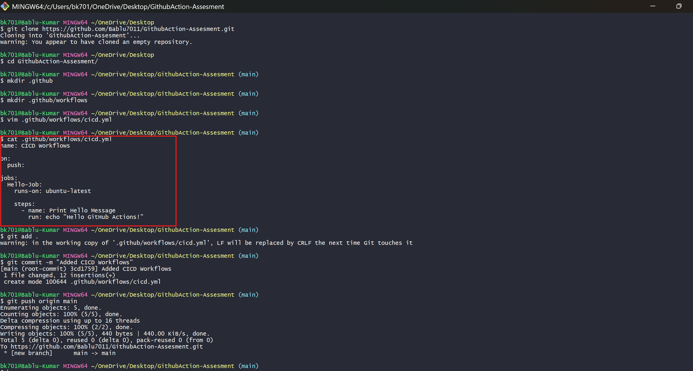
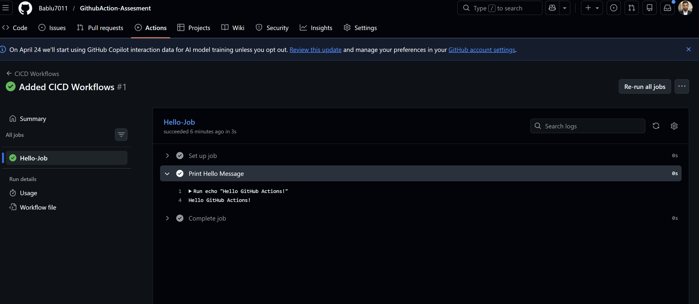

## ✅ Result

* Workflow triggered on push
* Successfully printed message in Actions logs

---

# ✅ Task 2 – Docker Build & Push

## 🎯 Objective

Automate Docker image build and push to Docker Hub.

## ⚙️ Steps

* Created `Dockerfile` (multi-stage build)
* Created `.dockerignore`
* Added workflow:

  ```
  .github/workflows/docker-ci.yml
  ```
* Steps included:

  * Checkout code
  * Docker login using secrets
  * Build image
  * Tag with:

    * `latest`
    * commit SHA
  * Push to Docker Hub

## 🔐 Secrets Used

* `DOCKER_USERNAME`
* `DOCKER_PASSWORD`

## 📷 Output

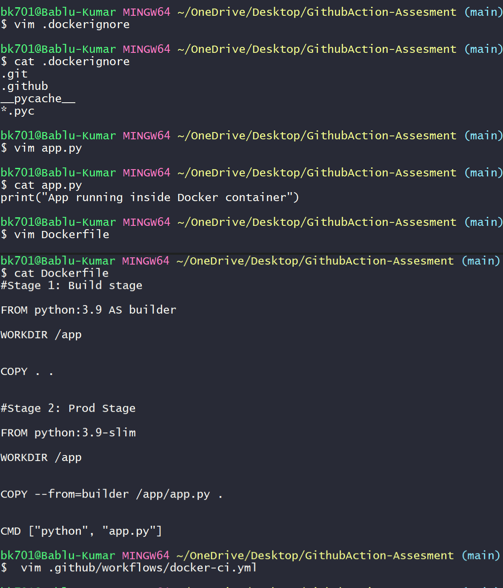
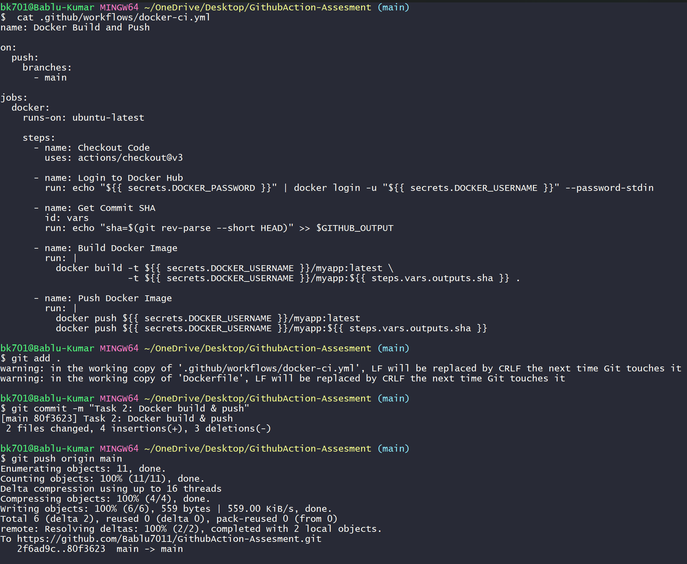


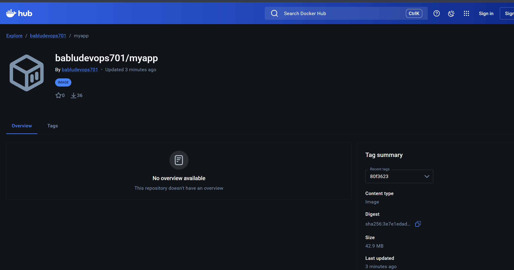

## ✅ Result

* Docker image successfully built and pushed
* Image visible on Docker Hub

---

# ✅ Task 3 – Reusable Workflow

## 🎯 Objective

Create reusable workflow and use it in another repo.

## ⚙️ Steps

* Created separate repo:

  ```
  GithubActions-workflows
  ```
* Added reusable workflow using:

  ```
  workflow_call
  ```
* Inputs:

  * `image_name`
  * `tag`
* Created version:

  ```
  v1.0.x
  ```

### Caller Workflow

* Called reusable workflow using:

  ```
  uses: <repo>@version
  ```
* Branch-based tagging:

  * `main` → `prod-<sha>`
  * `develop` → `staging-<sha>`

## 📷 Output

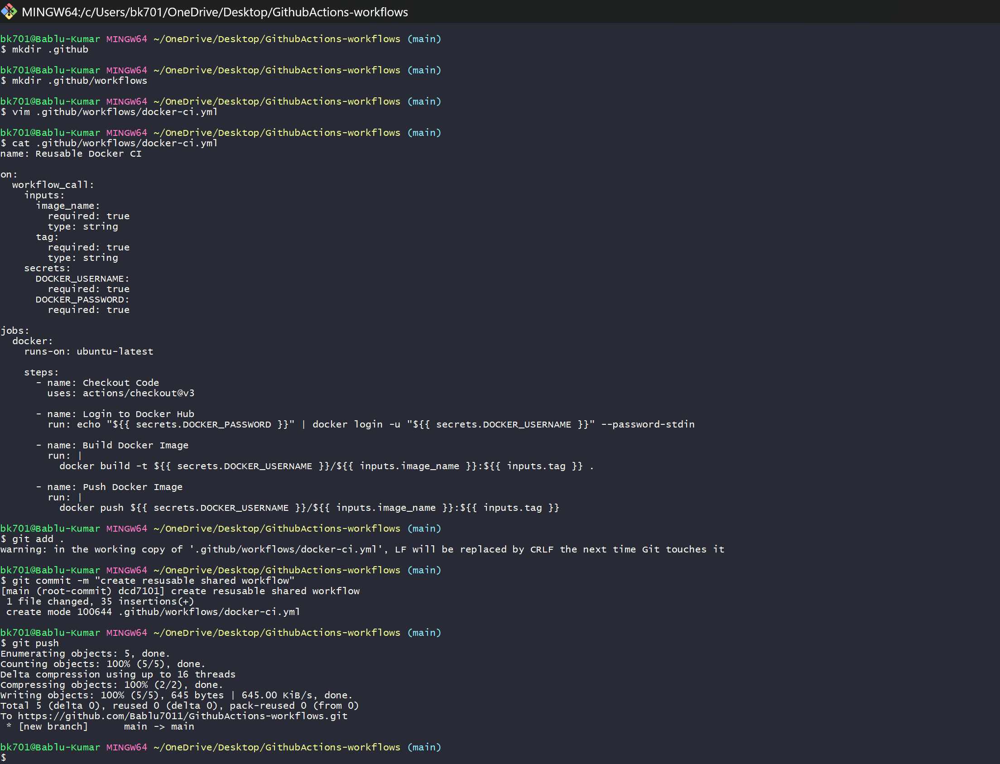


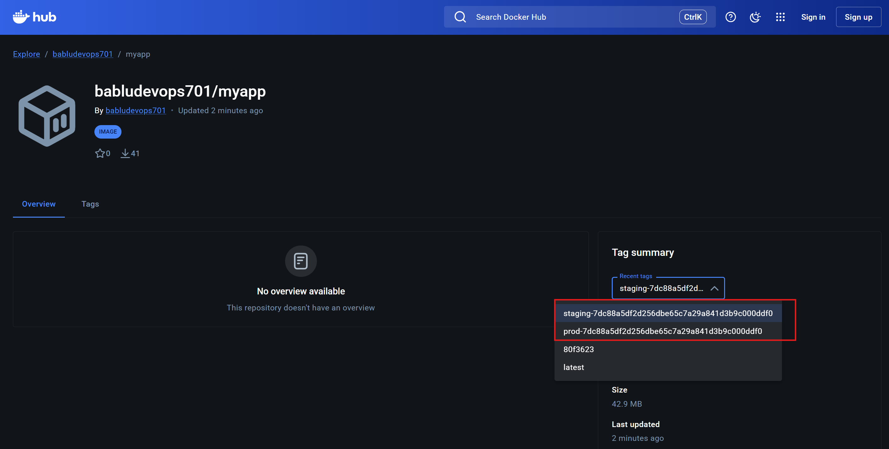

## ✅ Result

* Workflow reused successfully
* Images pushed with different tags based on branch

---

# ✅ Task 4 – Security Scan & Slack Notification

## 🎯 Objective

Enhance pipeline with security and notifications.

## ⚙️ Steps

### 🔍 Trivy Security Scan

* Integrated:

  ```
  aquasecurity/trivy-action
  ```
* Config:

  * Scan Docker image
  * Fail only on `CRITICAL` vulnerabilities

### 📢 Slack Notification

* Added webhook integration
* Notifications:

  * ✅ Success message
  * ❌ Failure message

## 🔐 Secrets Used

* `SLACK_WEBHOOK_URL`

## 📷 Output

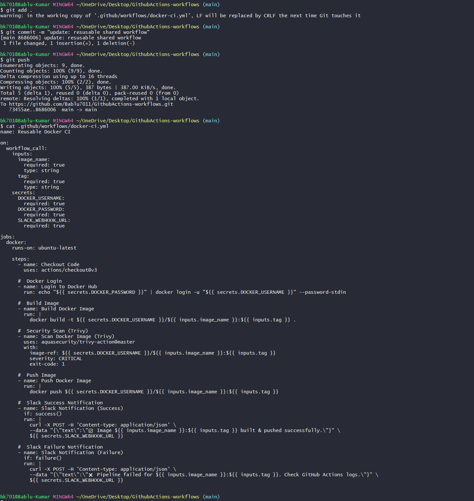

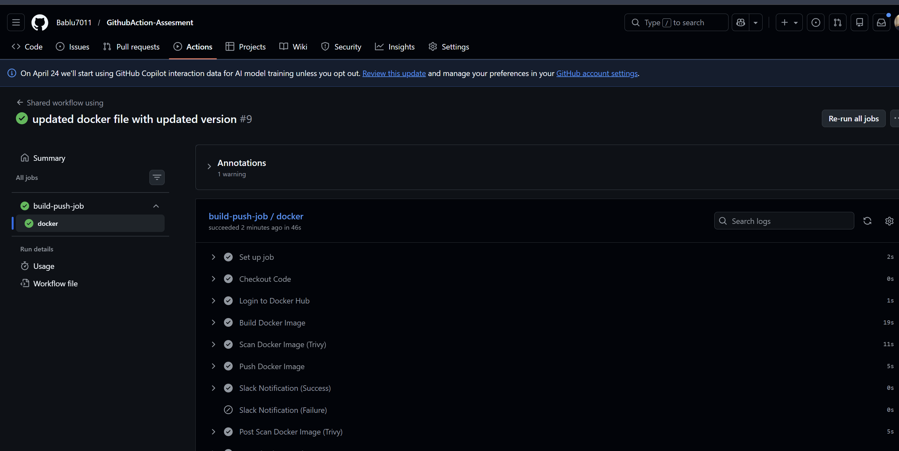
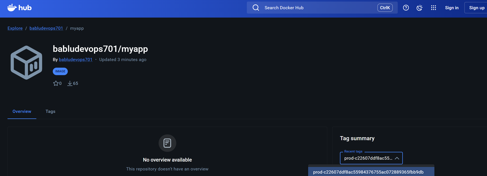


### --- Below is Workflw logs ---


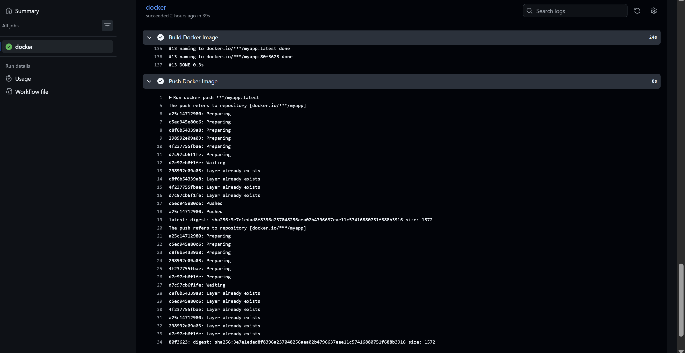

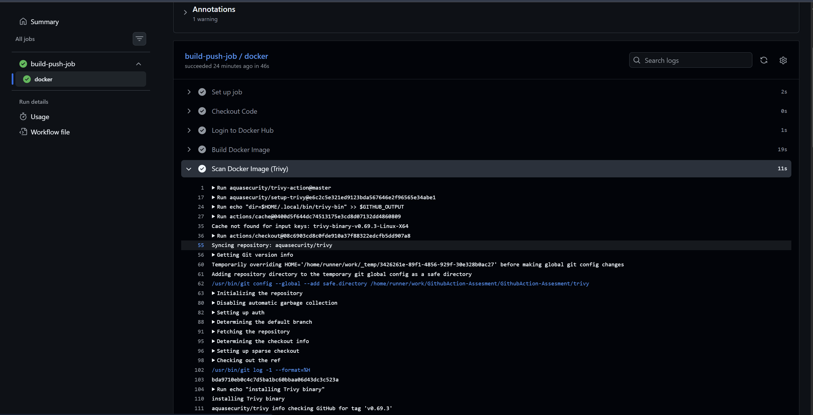
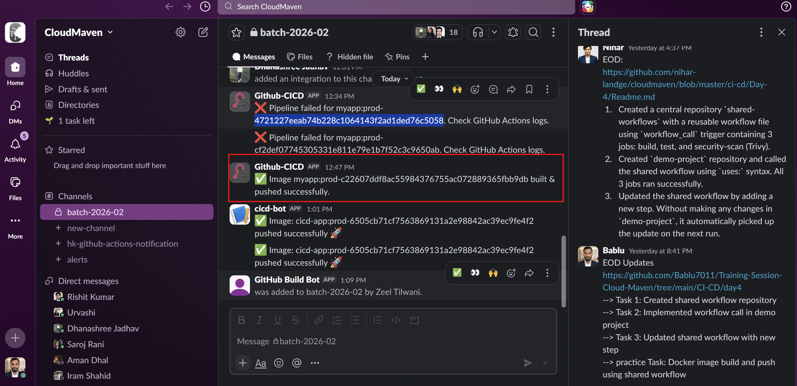